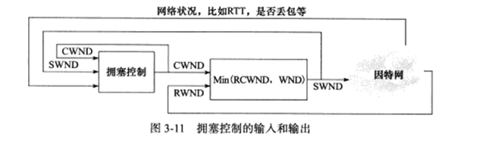
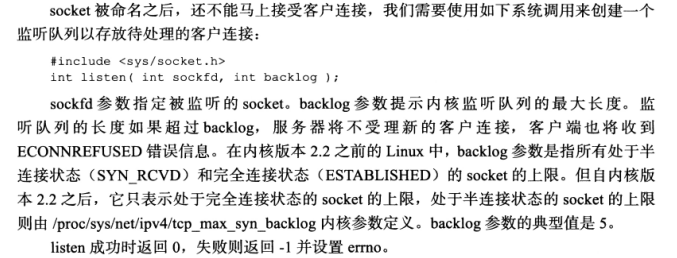
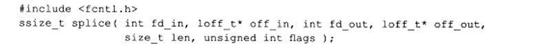
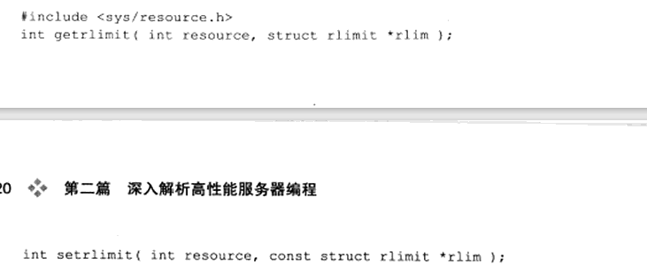
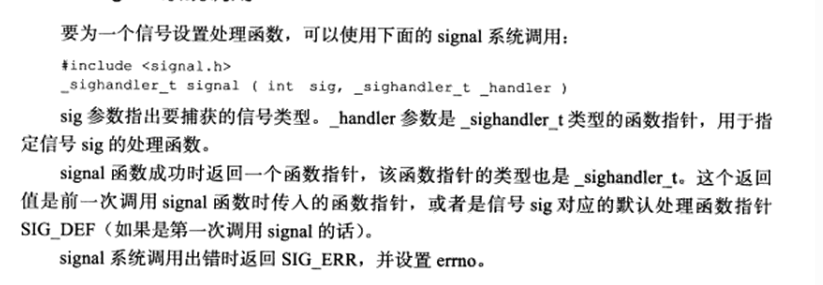
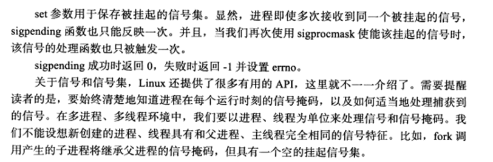
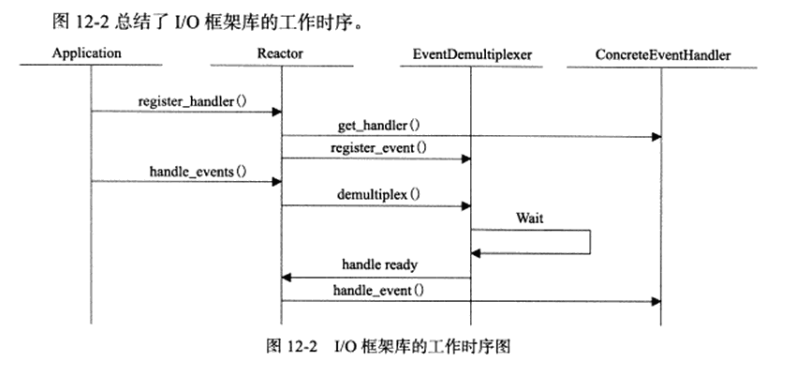
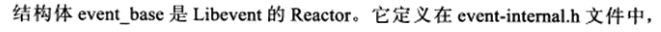
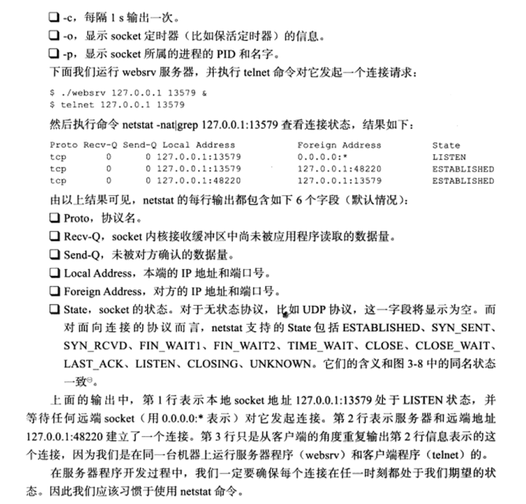

# Linux高性能服务器编程

## 第一章	TCP/IP协议详解

### 1.1 	TCP/IP协议族体系以及主要协议

TCP/IP是一个四层协议系统，自底而上，每一层完成不同的功能，通过若干协议来实现，上层协议使用下层协议提供的服务。


#### 1.1.1	数据链路层

数据链路层实现了网卡接口的网络驱动程序，使处理数据在物理媒介上传输。

ARP协议（地址解析协议），RARP协议（逆地址解析协议）。实现IP地址和机器地址物理地址（MAC地址）之间的互相转换。

ARR协议：IP地址转物理地址。

RARR协议：用于服务器上无盘工作站通过物理地址来查询IP地址。

#### 1.1.2	网络层

网络层实现了数据包的选路和转发。

任务：选择中间节点，以确定主机之间的通信路径。同时对上层协议隐藏网络拓扑连接的细节，在传输层和网路应用程序看来，通信是双方直接相连接的。

IP协议：使用逐跳的方式确定通信路径，根据目标的IP地址来决定如何投递数据包，确定通信路径。

ICMP协议：IP协议的重要补充，用于检测网络连接。并非严格意义上的网络层协议，因为它使用处于同一层的IP协议提供的服务。在IP主机和路由器之间传递控制消息（网络通不通、主机是否可达等）。


差错报文：主要用来回应网络错误

查询报文：查询网络信息

#### 1.1.3	传输层

传输层为两台主机上的应用程序提供端到端的通信，只关心通信起始端和目的端，不关心数据包的中转过程。

下图展现传输层和网络层差异：


TCP协议（传输控制协议）：为应用层提供可靠的，面向连接和基于流的服务。

UDP协议（用户数据报协议）：为应用层提供不可靠，无连接和基于数据报的服务。

#### 1.1.4	应用层

应用层负责处理应用程序的逻辑。

ping是应用程序，利用ICMP报文检测网络连接，是用来调试环境的必备工具。

relnet协议是一种远程登录协议，它使我们能在本地完成远程任务

OSPF（开放最短路径优先）协议是一种动态路由更新协议，用于路由器之间的通信，以告知对方各自的路由信息。

DNS（域名服务）协议提供机器域名到IP地址的转换

### 1.2	封装

每一层协议都在上层数据的基础上加上之间自身的头部信息进行封装。


经过以太网封装的数据称为帧。

### 1.3	分用

当帧到达目的主机时，将沿着协议自底向上依次传递。各层协议依次处理帧中本层负责的头部数据，并将处理后的帧交给应用程序


### 1.5	ARP协议工作原理

ARP协议能实现任意网络层地址到物理地址的转换。

工作原理：在自己所在的网络广播一个ARP请求，只有目标机器会回应一个ARP应答。

### 1.6	DNS工作原理

DNS是一套分布式的域名服务系统，存放着大量机器名和IP地址的映射。

#### 1.6.1 DNS查询和应答报文详解

DNS查询和应答报文格式：


DNS报文头部的16位标志字段，用于协商具体的通信方式和反馈通信状态：


查询问题的格式：


应答字段，授权字段和额外信息字段都使用资源记录格式：


#### 1.6.2 Linux 下访问DNS服务

使用 /etc/resolv.conf 文件存放DNS服务器的IP地址。


host 命令


### 1.7 	socket 和TCP/IP协议族的关系

数据链路层、网络层、传输层是在内核中实现的，为了使应用层访问内核，需要一组系统调用的API，socket就是最常用的一种。

socket的两点功能：

1. 将应用程序数据从缓冲区复制到TCP/UDP内核发送缓冲区，或从内核TCP/UDP接收缓冲区中复制数据到用户缓冲区以读取数据
2. 可以通过socket修改内核中各层协议的头部信息或其他数据结构。

## 第二章	IP协议详解

### 2.1	IP服务的特点

IP协议是TCP/IP协议族的动力，它为上层协议提供无状态，无连接，不可靠的服务。

- 无状态：数据以IP数据报发送，缺点：无法处理乱序和重复的IP数据报。优点：简单，高效。
- 无连接：IP通信双方都不长久地维持对方的任何信息。
- 不可靠：不能保证IP数据报准确的到达接收端。

### 2.2 IPv4头部结构


### 2.3	 IP分片

当IP数据报的长度超过帧的MTU时，它将被切片传输。 在目标机器的内核中的IP模块重新组装。

### 2.4	IP路由

IP协议的一个核心任务是数据报的路由，即决定数据报到目标机器的路径。

#### 2.4.1	IP模块工作流程


#### 2.4.2	路由机制


### 2.5	IP转发

不是发送给本机的IP数据报将由数据报转发子模块来处理。

路由器可以执行数据报的转发操作。

### 2.6	重定向

ICMP 重定向报文也能用于更新路由表

#### 2.6.1	ICMP 重定向报文


### 2.7	IPv6 头部结构

解决了IPv4地址不够用的问题。

#### 2.7.1	IPv6 固定头部结构


2.7.2	IPv6 扩展头部


## 第三章	TCP 协议详解

### 3.1	 TCP服务的特点

对比 UDP 协议的优点：面向连接，字节流和可靠传输。

- 使用TCP协议通信的双方必须先建立连接，然后才能数据读写，全双工
- TCP协议是一对一的，所以不适用于基于广播和多播的应用程序。
- 

TCP传输是可靠的。

1. 发送应答机制，每个报文都需要得到接收方的应答，才会认为成功。
2. 超时重传机制，一个TCP报文发出以后启动定时器，如果在定时时间内未收到应答，它将重发该报文。
3. 会对收到的TCP报文段重排，整理，再交付给应用层。因为TCP报文段最终是以IP数据报文发送的。

### 3.2	TCP 头部结构

#### 3.2.1	固定头部结构


#### 3.2.2	TCP 头部选项

TCP头部的最后一个选项字段是可变的可选信息。


### 3.3	TCP 连接的建立和关闭

#### 3.3.1	观察TCP连接的建立和关闭


#### 3.3.2	半关闭状态


#### 3.3.3	连接超时

因服务器很远或者是网络繁忙，导致服务器对客户端发出的同步报文无响应，TCP协议会先重连。重连无效，则会通知应用程序连接超时。

### 3.4	TCP状态转移

TCP连接的任意一端在任一时刻都处于某种状态。


#### 3.4.1	TCP状态转移总图


#### 3.4.2	TIME_WAIT 状态

从 图 3.9 来看，客户端连接在接收到服务器的结束报文（TCP报文段6）之后，进入 TIME_WAIT 状态。

存在的原因：

- 可靠的终止 TCP 连接。
- 保证让迟来的 TCP 报文段由足够的时间被识别并丢弃。

### 3.5	复位报文段

在某些特殊条件下，TCP连接的一段会向另一端发送携带RST标志的报文段，即复位报文段，以通知对方关闭连接或者建立连接。

#### 3.5.1	访问不存在的端口

访问不存在的端口时，目标主机将给它发送一个复位报文段。

#### 3.5.2	异常终止连接

一个异常终止的方法：给对方发送一个复位报文段，一旦发生了复位报文段，发送端所有排队等待发送的数据都将丢弃。

#### 3.5.3 	处理半打开连接


### 3.6	TCP交互数据流

交互数据：包含少量字节。实时性很高。

成块数据：长度通常是TCP报文段允许的最长数据长度。传输效率很高。

### 3.7	成块数据流

用FTP协议传输一个大文件。

### 3.8	带外数据

用于迅速通告对方北端发生的重要事件。

### 3.9	 TCP超时重传

重传超过时间内未收到确定的TCP报文段。

### 3.10	拥塞控制

#### 3.10.1	拥塞控制概述

拥塞控制：提高网络利用率，降低丢包率，并保证网络资源对每条数据流的公平性。

受控变量是发送端向网络一次连续写入的数据量。SWND

SMSS（发送者最大段大小），CWND 拥塞窗口。



#### 3.10.2	慢启动和拥塞避免


#### 3.10.3	快速重传和快速恢复


## 第四章	TCP/IP通信案例：访问Internet上的Web服务器

###  4.1	实例总图


### 4.2	部署代理服务器

#### 4.2.1	HTTP代理服务器的工作原理

 在HTTP的通信链上，通常存在某些中转代理服务器，提供对目标资源的中转访问。

一个HTTP请求可能被多个代理服务器转发，后面的服务器称为前面服务器的上游服务器。

按照使用方式和功能分为：正向代理服务器，反向代理服务器和透明服务器。

正向服务器：要求客户端自己设置代理服务器的地址，客户每次的请求都直接发到该代理服务器，由代理服务器来请求目标资源。

反向代理设置在服务器端，客户端无需进行任何设置，反向代理指用代理服务器来接收Internet上的连接请求，然后将请求发送到内部网络上的服务器，并从内部服务器将结果返回给客户端。


透明代理只能设置在网关上。可以看做正向代理的一种特殊情况。

### 4.4	访问DNS服务器


### 4.5	本地名称查询

一般来说，通过域名来访问Internet上的某台主机时，需要使用DNS服务来获取该主机的IP地址。但如果要访问本地局域网上的机器，则可通过本地的静态文件来获得该机器的IP地址。

### 4.6	HTTP通信


#### 4.6.1	HTTP请求

9种请求方法


#### 4.6.2	HTTP应答

HTTP应答的部分内容：


## 第五章	Linux网络编程基础API

### socket地址API

#### 5.1.1	主机字节序和网络字节序

主机字节序（小端字节序），网络字节序（大端字节序）指的是不同字节（高位，低位）储存在内存的不同地址（高地址，低地址）处，格式化数据在两台不同的字节序主机中传播时，会造成错误解释，因此有解决方法：

- 发送端将字节序转化为网络字节序后在发送，接收根据自身字节序决定是否转换。

字节序转换函数：

```c++
#include<netinet/in.h>
unsigned long int htonl(unsigned long int hostlong);
unsigned short int htons(unsigned short int hostshort);
unsigned long int ntohl(unsigned long int netlong);
unsigned short int ntohs(unsigned short int netshort);
```

通常长整型函数通常用来转换IP地址，短整型函数用来转换端口号。

#### 5.1.2	通用socket地址

```c++
#include<bits/socket.h>
struct sockaddr
{
	sa_family sa_family;
	char sa_data[14];
}
```


#### 5.1.3	专用socket地址

Linux为各个协议族提供了专用的socket地址结构体。


所有专用socket地址结构体在实际使用时都需要转化为socket地址连续socketaddr。

#### 5.1.4	IP地址转换函数

十进制字符串表示IPv4，十六进制表示IPv6地址。

```
#include<arpa/inet.h>
in_addr_t inet_addr(const char* strptr);
int inet_aton(const chat* cp,struct in_addr* inp);
char* inrt_ntoa(stuct in_addr in);
```


5.2	创建socket


### 5.3 	命名socket


### 5.4 监听socket



### 5.5	接受连接


### 5.6	发起连接


### 5.7	关闭连接


### 5.8	数据读写

#### 5.8.1	TCP 数据读写


#### 5.8.2	UDP数据读写


#### 5.8.4	通用数据读写函数


### 5.9	带外标记


### 5.10	地址信息函数


### 5.11	socket 选项


### 5.12	网络信息API

#### 5.12.1	gethostbyname 和 gethostbyaddr


#### 5.12.2	getservbyname 和 getservbyport


#### 5.12.3	getaddrinfo


#### 5.12.4	getnameinfo


## 第六章	高级 I/O 函数

### 6.1	pipe 函数


#### socketpair


### 6.2	dup 函数和 dup2 函数


### 6.3	readv 函数和 writev 函数


#### 6.4	sendfile 函数


### 6.5	mmap 函数和 munmap 函数


### 6.6	splice 函数



### 6.7	tee 函数


### 6.8	fcntl 函数


## 第七章	Linux服务器程序规范

- 后台运行
- 日志系统
- 以某个非 root 身份运行
- 程序可配置
- 生成PID文件
- 考虑系统资源和限制

### 7.1	日志

#### 7.1.1	Linux 系统日志

提供一个守护进程来处理系统日志 syslogd 


日志输出到 /dev/log ，环状缓存映射到 /proc/kmsg ，rsyslogd 通过读取该文件获得内核文件。

调试信息 /var/log/debug 文件，内核消息 /var/log/debug 文件，普通消息 /var/log/messages 文件。

rsyslogd 的主配置文件 /etc/rsyslogd.conf

#### 7.1.2	 syslog 函数


### 7.2	用户信息

#### 7.2.1	UID , EUID , GID , EGID

真实用户，有效用户，真实组，有效组

### 7.3	进程间关系

#### 7.3.1	进程组


#### 7.3.2	会话


#### 7.3.3	用 ps 命令查看进程关系


### 7.4	系统资源限制



### 7.5	改变工作目录和根录目


### 7.6	服务器程序后台化


## 第 八 章	高性能服务器程序框架

I/O 处理单元

逻辑单元

储存单元

### 8.1	服务器模型

#### 8.1.1	C/S 模型


#### 8.1.2	P2P 模型


### 8.2	服务器编程框架


### 8.3	I/O	模型

阻塞的文件描述符为阻塞 I/O ，非阻塞的文件描述符为非阻塞 I/O 。


### 8.4	两种高效的事件处理模式

I/O 事件，信号及定时事件。

事件处理模式：Reactor 和 Proactor 。

#### 8.4.1	Reactor 模式


#### 8.4.2	Proactor


#### 8.4.3	模拟 Proactor 模式


#### 8.5	两种高效的并发模式

半同步/半异步模式，领导者/追随者模式。

#### 8.5.1	半同步/半异步模式


#### 8.5.2	领导者/追随者模式


### 8.6	有限状态机


### 8.7	提高服务器性能的其他建议

#### 8.7.1	池

空间换时间，分配系统资源的系统调用很耗时间，把要使用的资源放回池中。

静态分配。

#### 8.7.2	数据复制

避免不必要的数据复制

#### 8.7.3	上下文切换和锁

不能为每个客户都创建一个工作线程。


## 第 九 章	I/O复用

同时处理多个 socket 。

同时处理用户输入和网络连接。

同时处理监听 socket 和连接 socket 。

同时处理 TCP 请求和 UDP 请求。

同时监听多个端口，或者处理多种服务。

### 9.1	select 系统调用

在一段指定的时间中，监听用户感兴趣的文件描述符上的可读，可写和异常等事件。

#### 9.1.1	select API


#### 9.1.2	文件描述符就绪条件


#### 9.1.3	处理带外数据

普通数据 - 可读状态

带外数据 - 异常状态

### 9.2	poll 系统调用

轮询一定数量的文件描述符，测试其中是否有就绪者。


### 9.3	epoll 系列系统调用

#### 9.3.1	内核事件表

epoll 需要使用一个额外的文件描述符


#### 9.3.2	epoll_wqit 函数

返回就绪的文件描述符的个数，失败时返回 -1 并设置 errno 。


#### 9.3.3	LT 和 ET 模式

电平触发模式，边沿触发模式。

#### 9.3.4	EPOLLONESHOT 事件

对于注册了 EPOLLONESHOT 事件的文件描述符，操作系统最多触发其上注册的一个可读，可写或者异常事件，且只触发一次。

### 9.4	三组 I/O 复用函数的比较


### 9.5	I/O 复用的高级应用一 ：非阻塞 connect


### 9.6	I/O 复用的高级应用二：聊天室程序

使用 I/O 复用技术来同时处理网络连接和用户输入。

#### 9.6.1	客户端

使用 poll 同时监听用户输入和网络连接，并利用 splice 函数将用户输入内容直接定向到网络连接上发送。

#### 9.6.2	服务器

使用 poll 同时管理监听 socket 和连接socket ， 并且使用牺牲空间换取时间的策略来提高服务器性能。

### 9.7	I/O 复用的高级应用三：同时处理 TCP 和 UDP 服务

要创建多个 socket 。

流 socket ，数据报 socket 。同时处理一个端口上的 TCP 和 UDP 。


### 9.8	超级服务 xinetd

同时管理多个子进程，监听多个端口。

#### 9.8.1	xinetd 配置文件

主配置文件：/etc/xinetd.conf

子配置文件：/etc/xinetd.d


#### 9.8.2	xinetd 工作流程


## 第 十 章	信号

对于前台进程，用户可以通过输入特殊的终端字符来给它发送信号。

系统异常。

系统状态变化。

运行 kill 命令或调用 kill 函数。

### 10.1	Linux 信号

#### 10.1.1	发送信号

一个进程给其他进程发送信号 API 是 kill 函数。


#### 10.1.2	信号处理方式


#### 10.1.3	Linux 信号


#### 10.1.4	中断系统调用

程序在执行处于阻塞状态的系统调用时收到信号，并且为该信号设置了处理函数，则默认情况下系统调用将被中断，并且 errno 被设置为 EINTR 。我们可以使用 sigaction 函数为信号设置 SA_RESTART 标志以重启被该信号中断的系统调用。

### 10.2	信号函数

#### 10.2.1	signal 系统调用



#### 10.2.2	sigaction 系统调用

更健壮的设置信号处理函数的系统调用：


### 10.3	信号集

#### 10.3.1	信号集函数

使用 sigset_t 表示一组信号。


#### 10.3.2	进程信号掩码


#### 10.3.3	被挂起的信号

设置进程信号掩码后，被屏蔽的信号将不能被进程接收。

如果给进程发送一个被屏蔽的信号，则操作系统将该信号为进程的一个被挂起的信号。

取消屏蔽，就被接受。




### 10.4	统一事件源

信号是一种异步事件：信号处理函数和程序的主循环是两挑不同的执行路线。

信号的主逻辑放到程序的主循环中，当信号处理函数被触发时，它只简单通知主循环程序收到信号，并传递信号，由主程序执行目标信号对应的逻辑代码。


### 10.5	网络编程相关信号

#### 10.5.1	SIGHUP


#### 10.5.2	SIGPIPE


#### 10.5.3	SIGURG

内核通知应用程序带外数据到达主要有两种方法。


## 第 十一 章	定时器

时间轮和时间堆。

定时是指在一段时间之后触发某段代码的机制，我们可以在这段代码中依次处理所有到期的定时器。

定时机制是定时器得以被处理的原动力。

- socket 选项 SO_RCVTIMEO 和 SO_SNDTIMEO 。
- SIGALRM 信号。
- I/O 复用系统调用的超时参数。

### 11.1	socket 选项 SO_RCVTIMEO 和 SO_SNDTIMEO

分别用来设置 socket 接收数据超时间和发送数据超时时间。


### 11.2	SIGALRM 信号


#### 11.2.1	基于升序链表的定时器

定时器通常至少要包含两个成员：一个超时时间和一个任务回调函数。

#### 11.2.2	处理非活动连接

升序定时器的实际应用 - 处理非活动连接。

给客户端发一个重连请求，或者关闭该连接。


### 11.3	I/O 复用系统调用的超时参数


### 11.4	高性能定时器

#### 11.4.1	时间轮


#### 11.4.2	时间堆


## 第 十二 章	高性能 I/O 框架库 Libevent

I/O 事件，信号，定时事件。

- 统一事件源
- 可移植性
- 对并发编程的支持

### 12.1	I/O 框架库概述

句柄：I/O框架库要处理的对象。一个事件源通常和一个句柄绑定在一起。当内核检测到就绪事件时，它通过句柄来通知应用程序这以事件。

事件多路分发器：事件的到来是随机的，异步的。需要事件循环，等待事件一般使用 I/O 复用技术来实现。一般会将系统支持的各种I/O复用系统调用封装成统一接口。


事件处理器和具体事件处理器：事件处理器执行事件对应的业务逻辑。框架提供的事件处理器通常是一个接口，用户需要继承它来实现自己的事件处理器，即具体事件处理器。

Reactor：I/O框架核心。提供几个主要方法。




#### 12.2	Libevent 源码分析

Libevent 具有如下特点：

- 跨平台支持。
- 统一事件源。
- 线程安全。
- 基于Reactor 模式的实现。
- 学习编写一个产品级的函数库要考虑那些细节。
- 提高 C 语言功底。

#### 12.2.1	一个实例


#### 12.2.2	源代码组织结构


#### 12.2.3	event 结构体


#### 12.2.4	往注册事件队列中添加事件处理器


#### 12.2.5	往事件多路分发器中注册事件


#### 12.2.6	eventop 结构体


#### 21.2.7	event_base 结构体



#### 12.2.8	事件循环


## 第 13 章	多进程编程

复制进程映像的 fork 系统调用和替换进程映像 exec 系列系统调用。

僵尸进程以及如何避免僵尸进程。

进程间通信最简单的方式：管道。

3 中 System V 进程间通信方式：信号量，消息队列和共享内存。

在进程间传递文件描述符的调用方法。

### 13.1	fork 系统调用


### 13.2	exec 系列系统调用


#### 13.3	处理僵尸进程


#### 13.4	管道


### 13.5	信号量

#### 13.5.1	信号量源语


#### 13.5.2	semget 系统调用


#### 13.5.3	semop 系统调用


#### 13.5.4	semctl 系统调用


#### 13.5.5	特殊键值 IPC_PRIVATE


### 13.6	共享内存

共享内存是最高效的IPC机制，因为它不涉及进程之间的任何数据传输。

#### 13.6.1	shmget 系统调用


#### 13.6.2	shmat 和 shmdt 系统调用


#### 13.6.3	shmctl 系统调用


并设置 errno 。

#### 13.6.4	共享内存的 POSIX 方法


#### 13.6.5	共享内存实例


### 13.7	消息队列

消息队列是在两个进程之间传递二进制数据的一种简单有效的方式。

#### 13.7.1	msgget 系统调用


#### 13.7.2	msgsnd 系统调用


13.7.3	msgrcv 系统调用

msgrcv 系统调用从消息队列中获取消息。


#### 13.7.4	msgctl 系统调用

控制消息队列的某些属性。


### 13.8	IPC 命令


### 13.9	在进程间传递文件描述符


## 第 十四 章	多线程编程

创建线程和结束线程。

读取和设置线程属性。

POSIX 线程同步方式：POSIX 信号量，互斥锁和条件变量。

### 14.1	Linux 线程概述

#### 14.1.1	线程模型

程序中完成一个独立任务的完整执行序列，即一个可调度的实体。

内核线程和用户线程。

完全在用户空间实现，完全由内核调度和双层调度。


### 14.2	创建线程和结束线程

pthread_create 创建一个线程的函数。


pthread_exit


pthread_join


pthread_cancel


### 14.3	线程属性


### 14.4	POSIX 信号量


### 14.5	互斥锁

#### 14.5.1	互斥锁基础 API


#### 14.5.2	互斥锁属性


#### 14.5.3	死锁举例


### 14.6	条件变量


### 14.7	线程同步机制包装类

### 14.8 多线程环境

#### 14.8.1	可重入函数


#### 14.8.2	线程和进程


#### 14.8.3	线程和信号

每个线程都可以独立地设置信号掩码。


## 第 十五 章	进程池和线程池

动态创建进程比较浪费时间，这将导致较慢的客户响应。

动态创建子进程通常只用来为一个客户服务，这将导致系统上产生大量的细微进程。进程间的切换将消耗大量的CPU时间。

动态创建的子进程是当前进程的完整映像。

### 15.1	进程池和线程池概述


### 15.2	处理多客户


### 15.3	半同步/半异步进程池实现

### 15.4	用进程池实现的简单 CGI 服务器

### 15.5	半同步/半反应堆线程池实现

### 15.6	用线程池实现的简单 Web 服务器

#### 15.6.1	http_conn 类


#### 15.6.2	main函数


## 第 十六 章	服务器调制，调试和测试

### 16.1	最大文件描述符数


### 16.2	调整内核参数


#### 16.2.1	/proc/sys/fs目录下的部分文件


#### 16.2.2	/proc/sys/net 目录下的部分文件


### 16.3	gdb 调试

#### 16.3.1	用 gdb 调试多进程程序

单独调试子进程


使用调试器选项 follow-fork-mode


16.3.2	用 gdb 调试多线程程序


### 16.4	压力测试


## 第 十七 章	系统检测工具

### 17.1	tcpdump


### 17.2	lsof


### 17.3	nc


### 17.4	strace


### 17.5	netstat




### 17.6	vmstat


### 17.7	ifstat


### 17.8	mpstat


