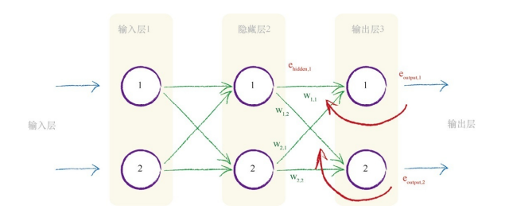
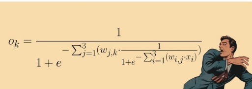

# Python神经网络编程

受到仿生智能计算的驱动，神经网络（Netural Network）出现了，并 且神经网络从此成为在人工智能领域中最强大、最有用的方法之一。

## 第一章	神经网络如何工作

### 1.1	尺有所短，寸有所长

人和计算机的区别

### 1.2	一台简单的预测机

计算过程中存在参数，需要调节，减少结果的误差。

### 1.3	分类器与预测器并无太大差别

- 分类器：参数。

- 预测器：存在参数后的输入。

### 1.4	训练简单的分类器

误差值，$$ \Delta $$，调节系数。

### 1.5	有时候一个分类器不足以求解问题

有时输入存在多个特征。

### 1.6	 神经元——大自然的计算机器

S函数

### 1.7	在神经网络中追踪信号

使用S函数计算。

### 1.8	凭心而论，矩阵乘法大有用途

使用矩阵乘法简化计算。

### 1.9	使用矩阵乘法的三层神经网络示例

一层一层的用矩阵乘法。

### 1.10	学习来自多个节点的权重

平分误差和按权重分配误差。

### 1.11	 多个输出节点反向传播误差

在两层的结构中按照权重分配误差。

### 1.12	反向传播误差到更多层中

### 1.13	使用矩阵乘法进行反向传播误差

### 1.14	我们实际上如何更新权重

梯度下降。

## 第2章	使用Python进行DIY

### 2.4	使用Python制作神经网络
